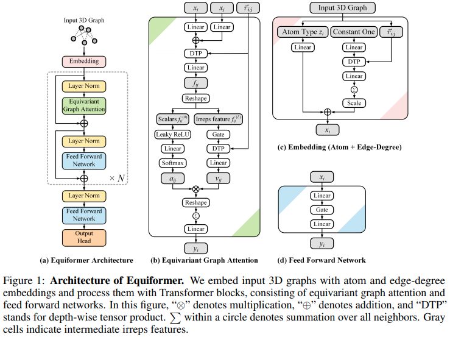

</img>

## Equiformer - Pytorch (wip)

Implementation of the <a href="https://arxiv.org/abs/2206.11990">Equiformer</a>, SE3/E3 equivariant attention network that reaches new SOTA, and adopted for use by <a href="https://www.biorxiv.org/content/10.1101/2022.10.07.511322v1">EquiFold (Prescient Design)</a> for protein folding

The design of this seems to build off of <a href="https://arxiv.org/abs/2006.10503">SE3 Transformers</a>, with the dot product attention replaced with MLP Attention and non-linear message passing from <a href="https://arxiv.org/abs/2105.14491">GATv2</a>. It also does a depthwise tensor product for a bit more efficiency. If you think I am mistakened, please feel free to email me.

Will report how it does on my toy task compared to some other networks I am more familiar with, once construction is complete.

This repository may eventually contain an implementation of EquiFold as well, with the added FAPE loss + structural violation checks

Update: The choice of the norm or gating (still need to ablate to figure out which [or both?]) is contributing to the greatly improved results. however, MLP attention does not seem to be doing anything (caveat, still missing a DTP in the values branch, and of course, need to check for bugs). more experiments pending

Update: Nevermind, MLP attention seems to be working, but about the same as dot product attention.

<a href="https://wandb.ai/lucidrains/equiformer/reports/equiformer-and-mlp-attention---VmlldzozMDQwMTY3?accessToken=xmj0a1c80m8hehylrmbr0hndka8kk1vxmdrmvtmy7r1qgphtnuhq1643cb76zgfo">Running experiment, denoising residue positions in protein sequence</a>

## Install

```bash
$ pip install equiformer-pytorch
```

## Usage

```python
import torch
from equiformer_pytorch import Equiformer

model = Equiformer(
    num_tokens = 24,
    dim = (4, 4, 2),               # dimensions per type, ascending, length must match number of degrees (num_degrees)
    dim_head = (4, 4, 4),          # dimension per attention head
    heads = (2, 2, 2),             # number of attention heads
    num_degrees = 3,               # number of degrees
    depth = 4,                     # depth of equivariant transformer
    attend_self = True,            # attending to self or not
    reduce_dim_out = True,         # whether to reduce out to dimension of 1, say for predicting new coordinates for type 1 features
    dot_product_attention = False  # set to False to try out MLP attention
).cuda()

feats = torch.randint(0, 24, (1, 128)).cuda()
coors = torch.randn(1, 128, 3).cuda()
mask  = torch.ones(1, 128).bool().cuda()

out = model(feats, coors, mask) # (1, 128)

out.type0 # invariant type 0    - (1, 128)
out.type1 # equivariant type 1  - (1, 128, 3)
```

## Appreciation

- <a href="https://stability.ai/">StabilityAI</a> for the generous sponsorship, as well as my other sponsors out there

## Testing

Tests for spherical harmonics, network equivariance etc

```bash
$ python setup.py test
```

## Todo

- [x] move xi and xj separate project and sum logic into Conv class
- [x] move self interacting key / value production into Conv, fix no pooling in conv with self interaction
- [x] go with a naive way to split up contribution from input degrees for DTP
- [x] for dot product attention in higher types, try euclidean distance

- [ ] start moving some spherical harmonic stuff to cpp or nim
- [ ] add memory checkpointing for the entire DTP module

## Citations

```bibtex
@article{Liao2022EquiformerEG,
    title   = {Equiformer: Equivariant Graph Attention Transformer for 3D Atomistic Graphs},
    author  = {Yi Liao and Tess E. Smidt},
    journal = {ArXiv},
    year    = {2022},
    volume  = {abs/2206.11990}
}
```

```bibtex
@article {Lee2022.10.07.511322,
    author  = {Lee, Jae Hyeon and Yadollahpour, Payman and Watkins, Andrew and Frey, Nathan C. and Leaver-Fay, Andrew and Ra, Stephen and Cho, Kyunghyun and Gligorijevic, Vladimir and Regev, Aviv and Bonneau, Richard},
    title   = {EquiFold: Protein Structure Prediction with a Novel Coarse-Grained Structure Representation},
    elocation-id = {2022.10.07.511322},
    year    = {2022},
    doi     = {10.1101/2022.10.07.511322},
    publisher = {Cold Spring Harbor Laboratory},
    URL     = {https://www.biorxiv.org/content/early/2022/10/08/2022.10.07.511322},
    eprint  = {https://www.biorxiv.org/content/early/2022/10/08/2022.10.07.511322.full.pdf},
    journal = {bioRxiv}
}
```

```bibtex
@article{Shazeer2019FastTD,
    title   = {Fast Transformer Decoding: One Write-Head is All You Need},
    author  = {Noam M. Shazeer},
    journal = {ArXiv},
    year    = {2019},
    volume  = {abs/1911.02150}
}
```

```bibtex
@misc{ding2021cogview,
    title   = {CogView: Mastering Text-to-Image Generation via Transformers},
    author  = {Ming Ding and Zhuoyi Yang and Wenyi Hong and Wendi Zheng and Chang Zhou and Da Yin and Junyang Lin and Xu Zou and Zhou Shao and Hongxia Yang and Jie Tang},
    year    = {2021},
    eprint  = {2105.13290},
    archivePrefix = {arXiv},
    primaryClass = {cs.CV}
}
```
